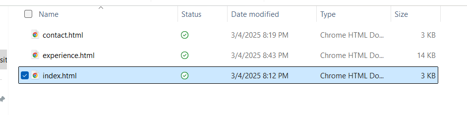
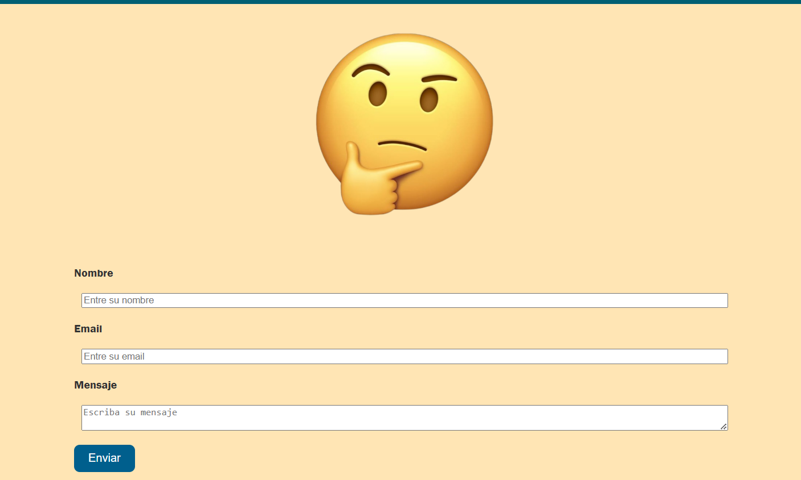
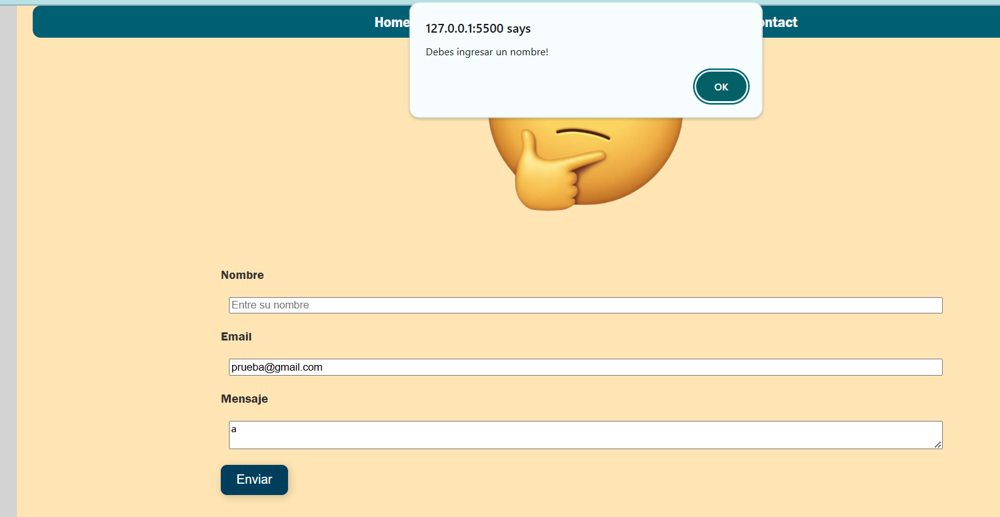

# CCOM4995-GabrielRomero-Assignment1

Gabriel Romero Torres
CCOM-4995
Dra. Yaira Rivera

<h2>Como correr el proyeto?</h2>

    Una vez el extraído el proyecto presione dos veces el archivo "index.html" y ábralo en su navegador preferido. Una vez abierto este archivo podrá disfrutar de todas las demás páginas.

<h2>Funcionalidades</h2>

<h3>Barra de Navegación</h3>

    La principal funcionalidad de este proyecto es su barra de navegación que te permite cambiar entre páginas de manera sencilla. El estilo para que siempre estuviera accesible se logró utilizando <code>position: fixed</code>. Más sobre los estilos de la barra de navegación en el archivo <code>/css/navbar.css</code>. 

<h3>Botones dentro de los "hero"</h3>

    Otra funcionalidad muy parecida a el navbar, pero presente en las tarjetas "hero" son los botones que redirigen a páginas con más informacion sobre las experiencias.

<h3>Form</h3>

<h4>Validación</h4>

    La funcionalidad principal de este form es que valida la entrada del usuario en todos los campos. A pesar de que no se valida de una manera convencional pues por ejemplo se aceptan nombres con solo 1 caracter, mensajes de solo 1 caracter, o emails como a@a.a, quise implementar esta validación "iterativa" para practicar mis habilidades con Javascript. En particular, probé la validación de email aunque el usuario manualmente elimine el 
    

    

<code>type="email"</code>. De esta manera me aseguro que la validación se lleve acabo sin importar esta modificación. Para ver cómo realizo la validación puede visitar el archivo <code>"js/form.js"</code>. Básicamente para hacer la validación añadí un "Event Listener" al elemento con <code>Id="form"</code>. Con esto realizado ya puedo invocar las distintas funciones pertinentes en cada ocasión que se someta el formulario.

<h4>Acción al someter dependiendo la validez.</h4>

    Una vez se determina el resultado de la validación, aparecerá una imagen indicando si se ha sometido sin errores o con errores.

<strong>Imagen al someter con éxito</strong>

<strong>Imagen al someter con algún error</strong>

<strong> 
    ACLARACIONES: EN EL AREA DE EXPERIENCIAS NO INCLUÍ NINGUNA EXPERIENCIA DE INTERNADO NI DE PROYECTO PORQUE NO LAS HE TENIDO. SIN EMBARGO INCLUÍ LAS QUE ENCONTRÉ PERTINENTES A MIS EXPERIENCIAS INCLUYENDO ACTIVIDADES EXTRACURRICULARES.
</strong>

<h2>Referencias</h2>

<ol>
    <li>    <a href="https://www.w3schools.com/jsref/jsref_obj_string.asp"> Métodos de string en Javascript</a>     </li>
    <li>    <a href="https://www.reddit.com/r/webdev/comments/182tyzu/how_to_prevent_page_refresh_when_auto_submitting/?rdt=57377"> Parar "refresh" al someter form</a>     </li>

</ol>
